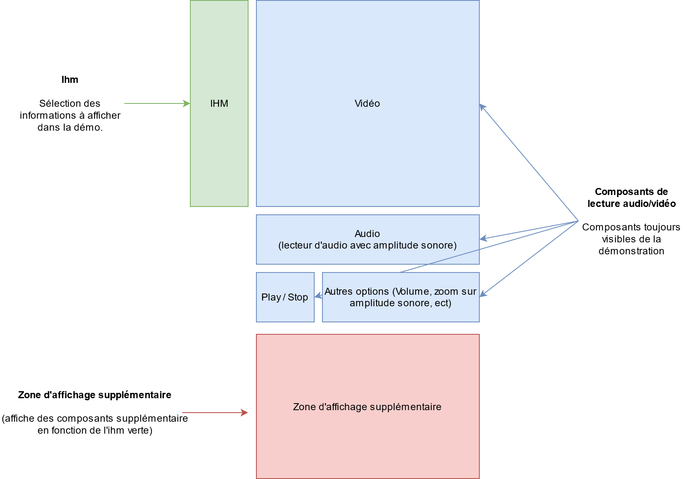

# Architecture

## Architecture générale

Le but est de permettre à l'utilisateur d'interagire via le composant vert pour changer la visualisation sur le composant bleue.

Il peut aussi activer l'affichage d'information supplémentaires via le composant rouge (dans notre cas, l'affichage du transcript enrichie des actes de languages).

Un composant, non-visible, permets de faire le lien logique entre les différents composants. Voir plus ici: [Provider](./Component/Provider.md).

-  IHM

Permets de modifier les paramètres générales de la démo

-  Lecteur audio-vidéo

-  Zone d'affichage supplémentaire

## Technologies utilisées

- React
- Node
- npm (gestionnaire de paquet)

## Librairies utilisées

- [Wavesurfer.js](https://wavesurfer-js.org/)

Librairie pour la lecture audio et l'affichage de l'amplitude audio.
Gère aussi l'emplacement de la lecture vidéo via la timeline (composant "" master "" de lecture).

- [Material ui](https://material-ui.com/)

Librairie permmettant d'avoir des composants pour l'IHM et pour le côté responsive.

- [Slate transcript editor](https://github.com/pietrop/slate-transcript-editor)

Librairie pour l'affichage du transcript et des actes de dialogue.
Attention: Version modifiée, présente dans `src/dependencies/slate-transcript-editor` utilisée pour l'affichage de l'act de dialogue
