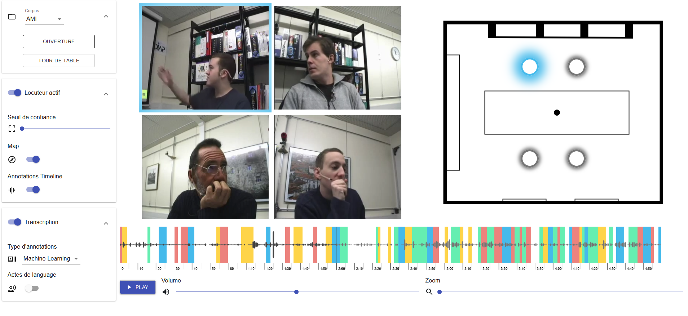
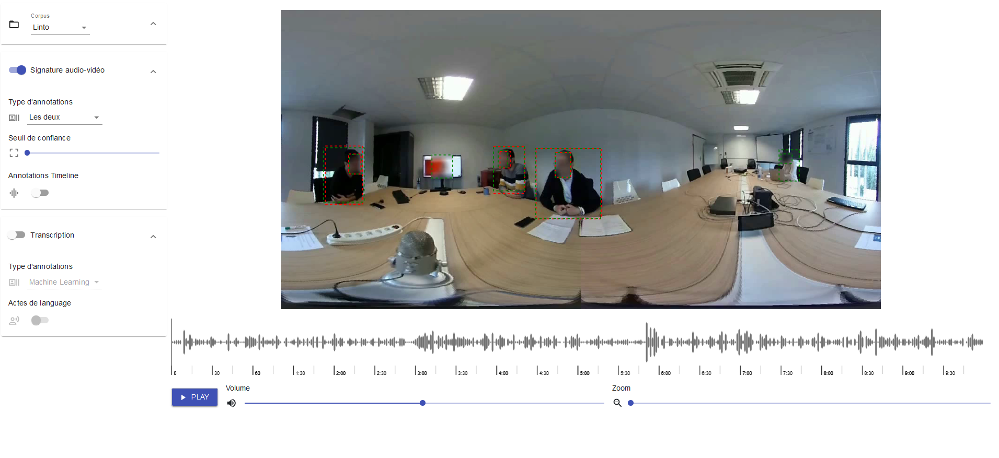
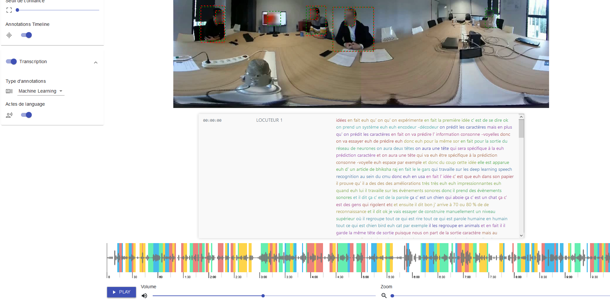
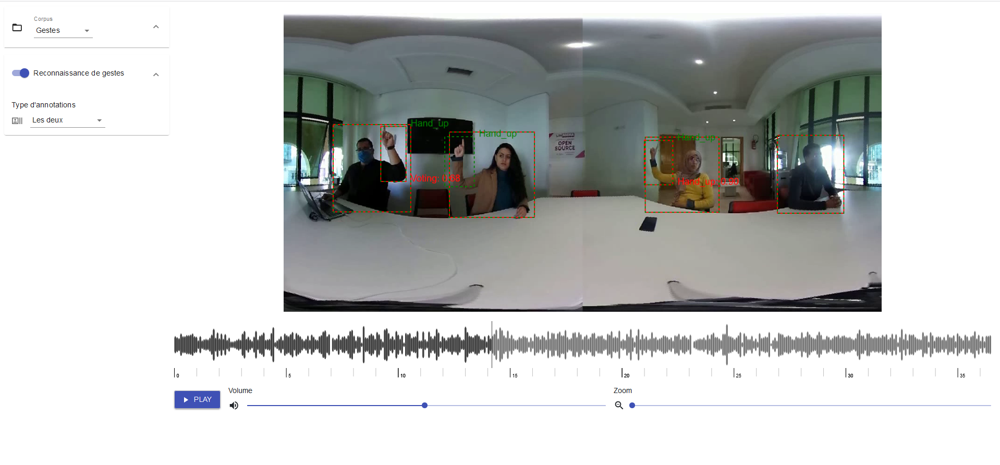

# Contexte

La présente web-application disponible dans ce github est un démonstrateur basé react-js proposé pouer l'illustration des travaux réalisés par SP2 de Linto (et une partie de SP5)

Son but est de permettre l'illustration simple et intuitive des différentes données renvoyées par la détection de locuteur actif, la signature audio-vidéo, la détection de gestes. Une partie sur SP5, concernant les actes de dialogues, est disponible.

 

## Vidéo explicative

 

## Images

### Corpus AMI (détection de locuteur actif)

 

### Corpus Linto (Signature audio/vidéo)

 

 

### Corpus Gestes

